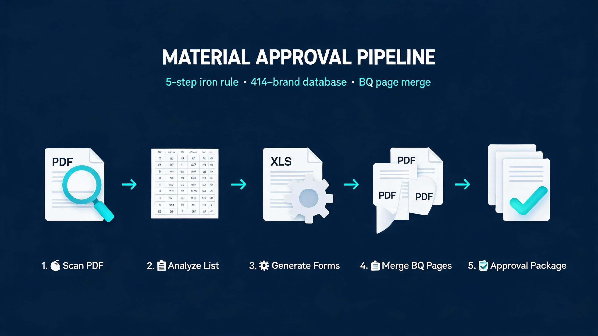

# 工程材料報批文件包 · 全流程管線 v2.9

<div align="center">



**Full pipeline for engineering material submittal document packages**

5-step iron rule · 414-brand recommendation engine · BQ page merge · 9 Python scripts

[快速開始](#快速開始) · [文件結構](#文件結構) · [版本演進](#版本演進)

</div>

---

> 從總表 + Excel 範本 + BQ PDF → 一套可以直接遞交嘅材料審批文件包。多個實戰項目提煉（港澳/大灣區），414 條品牌數據，5 步鐵律。

## 解決什麼問題

工程材料報批（Material Submittal）係每個建築項目都要做嘅例行工作，但：
- 幾十項材料，逐項整報批表 + 合併BQ頁，重複機械勞動
- 每個業主嘅編號規則、模板格式都唔一樣，好容易搞錯
- 品牌推薦靠經驗，新人唔知用咩牌子
- 雙承建商（總包+分判）、分批提交、回復跟蹤，文件管理混亂

**macau-material-approval** 將整套流程自動化，從總表生成到BQ頁合併一氣呵成。

## 核心特性

### 🔴 5 步鐵律（含用戶確認關卡）

| Step | 階段 | 關卡 |
|:---|:---|:---|
| 1 | 掃描版 PDF → 材料清單 | — |
| 2 | 分析 → 報批清單（編號+BQ對應） | — |
| 3 | **征詢用戶同意** | ⛔ 必須等確認 |
| 4 | 製作材料審批總表 | — |
| 5 | **用戶確認總表 → 批量生成** | ⛔ 未確認禁止爆量 |

### 🧠 引擎選擇決策樹
```
模板含 logo/中文字體/合併格？
├─ 是 → 有 Windows + Excel？
│       ├─ 是 → win32com 整張 Copy（gen_approval_forms.py）
│       └─ 否 → 純 ZIP 方案
└─ 否（純文字/數據）→ openpyxl 方案
```
> 點解唔用 openpyxl 操作含圖片模板？`copy_worksheet()` + `save()` 會丟 printerSettings、丟 DrawingML 圖片、破壞 rId 映射。

### 📋 完整編號規則
- **前綴系統**：AR(建築) / AG(供水) / EG(排水) / AC(冷氣) / EL(強電) / ELV(弱電) / FS(消防) / M(弱電通訊)
- **BQ 章節映射**：A/B/C/D/E/F → 因項目而異，必須由總表讀取
- **修訂尾綴**：A/B/C/AA、`(A)`、`-A`、無括號 `EL-063D`、`(3.0)` 版本前綴、`（取消）` 等 10+ 種樣式
- **業主專屬格式**：多種業主格式（市政雙語表 / 大學模板 / 政府項目編號體系）

### 🔗 BQ 頁合併（merge_bq.py）
材料 PDF = 審批表 + **BQ 對應頁** + 產品資料。`merge_bq.py` 實現：
- ✅ 自動模式（文字層提取 + BQ 碼匹配）
- ✅ 圖像型 PDF（OCR + 渲染截圖比對）
- ✅ 跨頁 BQ 項目（自動偵測延續頁）
- ✅ 產品資料頁自動附加
- ✅ 多 BQ 編號（頓號/逗號分隔）自動拆分
- ✅ 點號 BQ（E.1.2.1）+ 正規化
- ✅ 修訂尾綴匹配
- ✅ 雙編碼對應（`--code-map`：內部編號 ↔ BQ 編號）

### 🏷️ 414 條品牌推薦引擎
從 9 個實戰項目累積嘅品牌數據庫（非公開）：
- 4 級匹配：精確匹配 → 分類關鍵詞 → 同類替代 → 通用建議
- 雙語品牌支援（耐克森/Nexans、康普/Commscope 等）
- Case-insensitive + 拼寫變體歸一化（`CommScope`/`Comscope`、`MK`/`Mk`/`mk`）
- 9 大分類：電箱/線纜/燈具/開關插座/水管潔具/門鎖五金/建築材料/消防/弱電

> 🔒 **品牌數據庫為付費/授權內容**，不在此公開 repo 中。
> 如有商業使用或學術研究需求，請郵件聯絡商談授權：**david_1999cn@hotmail.com**

### 📦 一鍵加料（add_materials.py）
pre-flight 檢查 → 設值 → 出 PDF → append 產品資料 → sync 總表 → sync 美化版。
取代 6 支散腳本，單一入口完成所有操作。

### 🔄 完整工作流支援
- 分批提交（按日期文件夾歸檔）
- 回復雙文件夾（我方提交件 + 業主批復件）
- 物料替換/同等物料（指定品牌 → 申請替代論證）
- 雙承建商報批（總包 + 分判各自一份）
- 三向簽核（則師 + 用家 + 工務局）
- 自我複查紀律 SOP（每次任務後 5 步總結）

## 文件結構

```
macau-material-approval/
├── README.md                          # 本文件（GitHub 預覽頁）
├── DOCUMENTATION.md                   # 完整技能文檔（v2.9 / 516 行）
├── assets/
│   └── workflow-overview.jpg          # 管線流程圖
├── references/
│   ├── brand_db.json 🔒               # 414 條品牌數據庫（非公開，需郵件授權）
│   └── brand_examples.md              # 品牌推薦使用範例
└── scripts/
    ├── gen_approval_forms.py          # 生成報批表（win32com Copy）
    ├── export_forms_pdf.py            # 導出 PDF
    ├── merge_bq.py                    # BQ 頁合併（核心）
    ├── add_materials.py               # 一鍵加料工作流
    ├── helpers.py                     # 共用工具（excel_serial/fingerprint_bq 等）
    ├── brand_recommender.py           # 品牌推薦引擎
    ├── batch_brand_fill.py            # 批次品牌填寫
    ├── extract_models.py              # 型號提取
    └── append_bq.py                   # 舊版 BQ 追加（僅供參考）
```

## 技術棧

- **Python** — 主要腳本語言
- **pywin32 (win32com)** — Excel 模板高保真複製（含 logo/字體/圖片）
- **PyMuPDF** — PDF 提取、合併、渲染
- **openpyxl** — 純數據模板操作
- **JSON** — 品牌數據庫存儲格式

## 快速開始

1. 準備：總表 Excel + 報批表範本 + BQ PDF + 產品資料文件夾
2. 跟 [DOCUMENTATION.md](DOCUMENTATION.md) 嘅 5 步鐵律執行
3. Step 1-2：分析材料清單並徵詢用戶確認
4. Step 4：用 `gen_approval_forms.py` 生成總表 + 分項報批表
5. Step 5：用戶確認後，`export_forms_pdf.py` 導出 PDF → `merge_bq.py` 合併 BQ 頁
6. （可選）`brand_recommender.py` 自動推薦品牌 → `batch_brand_fill.py` 批次填入

## 版本演進

| 版本 | 日期 | 新增內容 | 品牌數 |
|:---|:---|:---|:---|
| v1.0 | 2026-06 | 基礎 5 步流程 | 162 |
| v2.1 | 2026-08-06 | 某政府項目實戰補強 | → 289 |
| v2.2 | 2026-08-06 | 某大學酒店實戰補強 | → 298 |
| v2.3 | 2026-08-06 | 某政府學院實戰補強 | → 320 |
| v2.4 | 2026-08-06 | 某市政項目實戰補強 | → 362 |
| v2.5 | 2026-08-06 | 某學校分校實戰補強 | → 376 |
| v2.6 | 2026-08-06 | 某公廁項目實戰補強 | → 403 |
| v2.7 | 2026-08-06 | 某社會設施項目實戰補強 | → 413 |
| v2.8 | 2026-08-06 | 某政府大樓項目實戰補強 | → 414 |
| v2.9 | 2026-08-26 | 某學校暑期工程 + 一鍵加料 + 自我複查 SOP | 414 |

## 適用行業

- 🏗️ 建築工程（總包 / 分判）
- ⚡ 機電工程
- ❄️ 空調冷凍
- 💧 給排水
- 🔥 消防工程
- 📡 弱電通訊
- 🏫 學校 / 酒店 / 政府辦公大樓裝修

**適用地區：港澳 · 大灣區 · 內地**

---

## License

MIT License — feel free to use, modify, and share.
